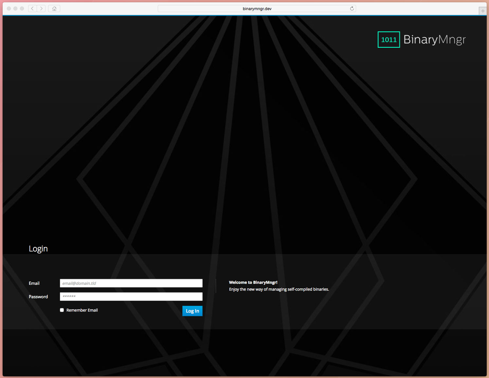
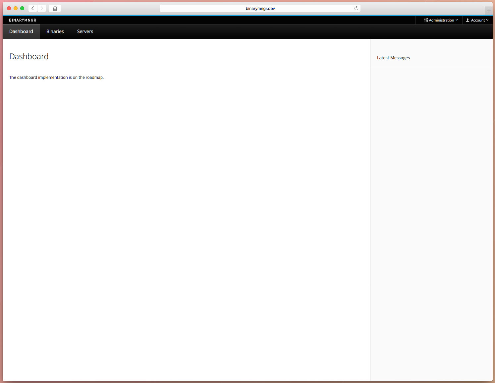
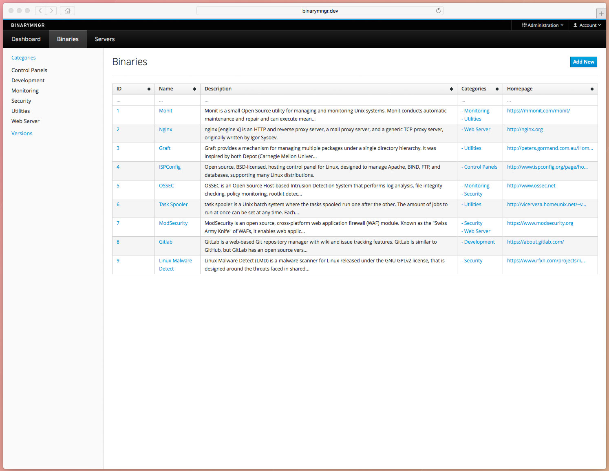
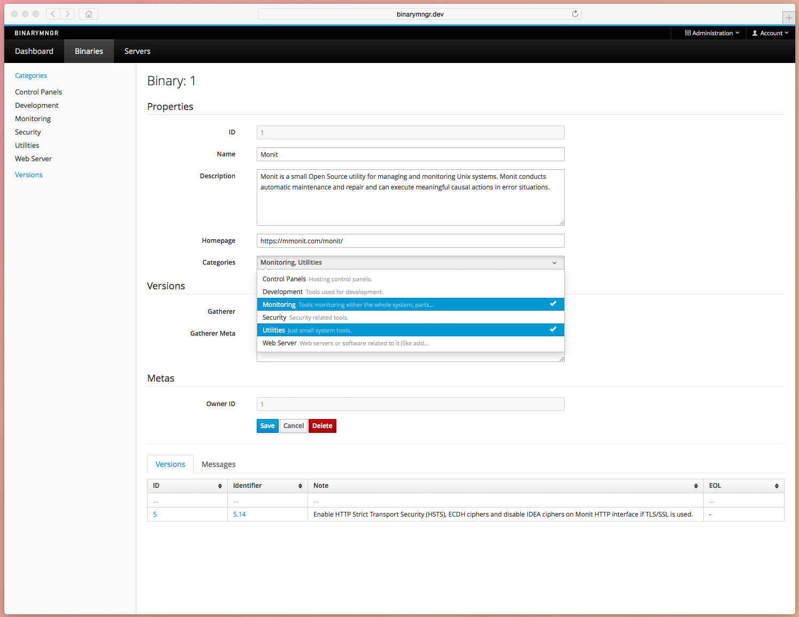
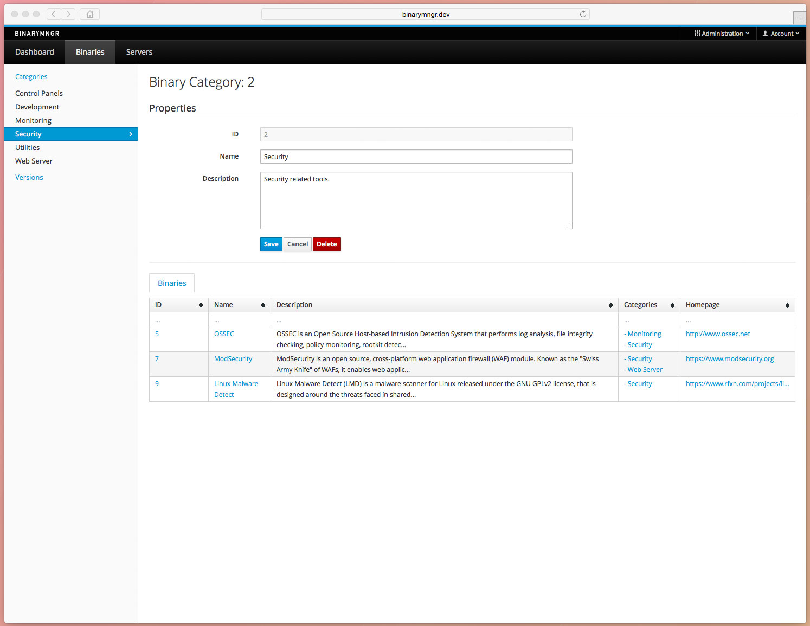
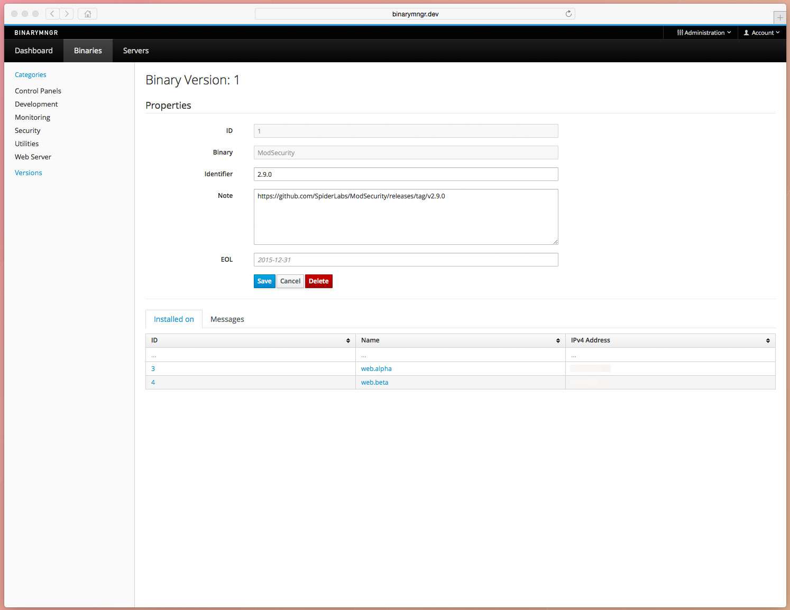
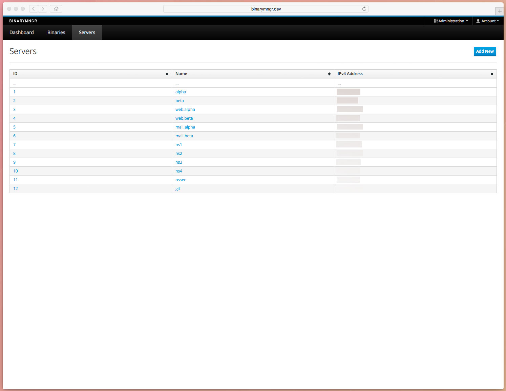
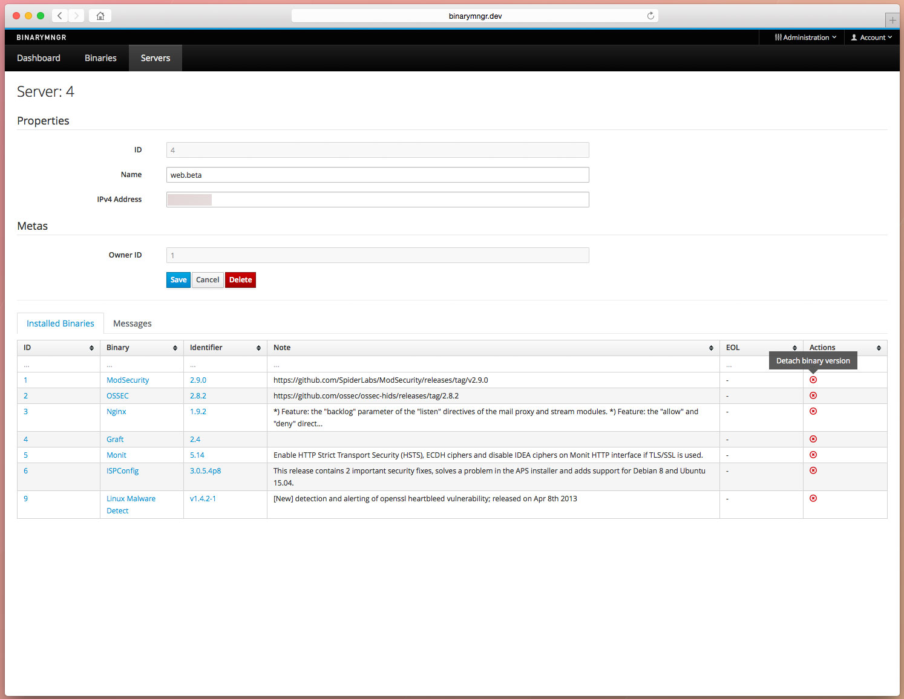
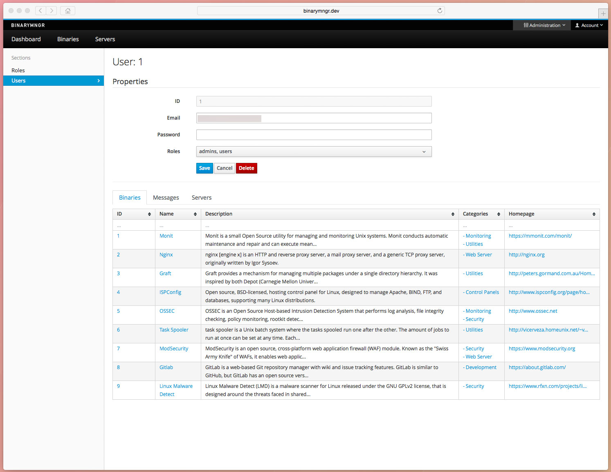

# binarymngr

> Enjoy the new way of managing self-compiled binaries.

## Technologies

- Server: PHP (Lumen Framework), MySQL
- Client: JS/CoffeeScript (SpineJS)

## Features

### Basic Features

- Binary Management: CRUD, Categorization
- Messages Management: CRUD
- Server Management: CRUD
- Users/Roles Management: CRUD

### Advanced Features

- Automatic binary versions gathering through pluggable gatherer implementations
- End-of-Life-Reached messages for binary versions
- Outdated binary version installed messages if a version newer than installed is added

> All together, this results in a fully automated environment that notifies you when:   
> 
> 1. you should upgrade a binary on a server (EOL)   
> 2. a new binary version got released and you should upgrade

### UI Features

- PatternFly based, fully responsive
- Sortable and filterable tables
- Highlighting of records needing attention (i.e. have a message)

## Installation

## Screenshots

